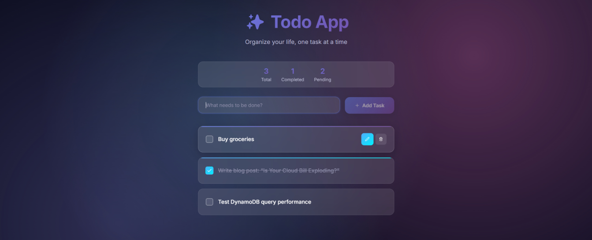
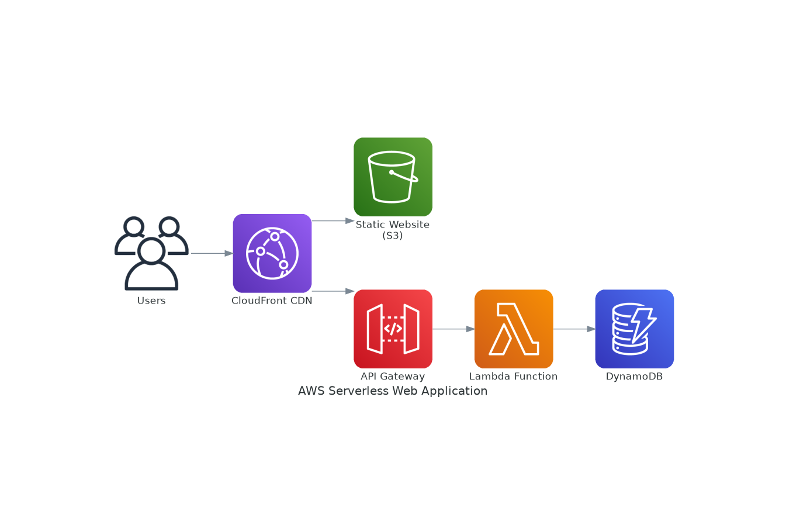
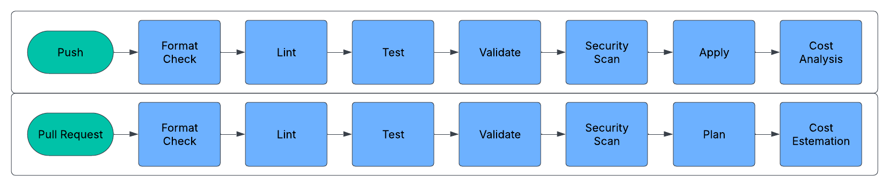
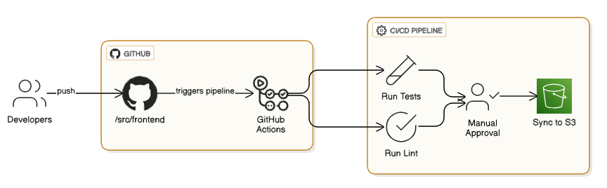
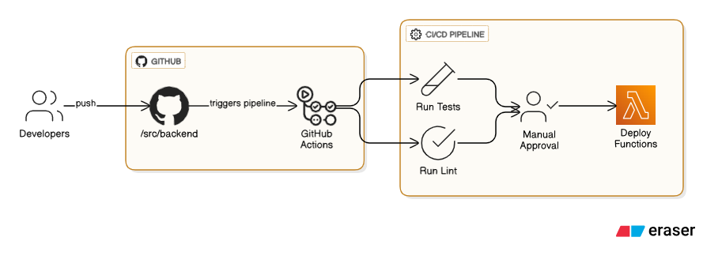

# Serverless Todo App on AWS - DevOps Edition


A production-style **serverless Todo application** built with React, AWS Lambda, API Gateway, DynamoDB, S3, CloudFront, Terraform, and GitHub Actions. The original app recipe is still simple: users create, update, list, and delete todos. The upgrade is in the DevOps layer: secure infrastructure, CI/CD, drift detection, security scanning, SBOM generation, observability, and optional AI-ready release summaries.



## Project Goal

This project is designed as a DevOps/Cloud portfolio project. Instead of only showing a basic Todo CRUD app, it shows how a small application can be engineered like a real AWS serverless workload with infrastructure as code, pipeline automation, security checks, and operational runbooks.

## Architecture



### Request Flow

```text
User Browser
   ↓
CloudFront CDN
   ↓
Private S3 Static Website Bucket
   ↓
React Frontend
   ↓
API Gateway HTTP API
   ↓
AWS Lambda CRUD Functions
   ↓
DynamoDB Todo Table
   ↓
CloudWatch Logs, Metrics, and Alarms
```

## What Was Upgraded

| Area | Upgrade |
|---|---|
| Backend API | Better validation, JSON responses, 404 handling, structured logs, and safer DynamoDB writes |
| Frontend | Supports the new API response format and environment-based API URL |
| Infrastructure | Terraform modules for frontend/backend, DynamoDB PITR, encrypted resources, CloudFront security headers, Lambda X-Ray tracing, log retention, and alarms |
| CI/CD | GitHub Actions for frontend, backend, Terraform, drift detection, security scan, and release summary |
| Security | OIDC-based AWS authentication, Trivy scans, CodeQL, Checkov, Dependabot, SBOM artifact, and secret-safe `.gitignore` |
| Operations | Runbook, architecture docs, screenshot guide, and optional AI-ready release summary |

## Existing Snapshots Included in README

### Terraform / Infrastructure CI/CD



### Frontend CI/CD



### Backend CI/CD



## Technology Stack

| Layer | Technology |
|---|---|
| Frontend | React, JavaScript, Axios, Framer Motion |
| Backend | Node.js 20, AWS Lambda, API Gateway HTTP API |
| Database | DynamoDB with pay-per-request billing and point-in-time recovery |
| Hosting | S3 private bucket and CloudFront with Origin Access Control |
| Infrastructure | Terraform, reusable modules, tfvars per environment |
| CI/CD | GitHub Actions |
| Security | IAM least privilege, OIDC, Trivy, CodeQL, Checkov, Dependabot |
| Observability | CloudWatch logs, Lambda metrics, X-Ray tracing, CloudWatch alarms |
| GenAI-ready Ops | Offline AI-style release summary script with optional Bedrock extension path |

## API Endpoints

| Method | Endpoint | Purpose |
|---|---|---|
| GET | `/todos` | List todos |
| POST | `/todos` | Create todo |
| GET | `/todos/{id}` | Get todo by ID |
| PUT | `/todos/{id}` | Update todo |
| DELETE | `/todos/{id}` | Delete todo |

### Sample Create Request

```bash
curl -X POST "$API_URL/todos" \
  -H "Content-Type: application/json" \
  -d '{"text":"Prepare Terraform deployment plan"}'
```

### Sample Response

```json
{
  "id": "85b07c2a-3e65-4d16-bb07-eac6d5f6cb5a",
  "text": "Prepare Terraform deployment plan",
  "checked": false,
  "createdAt": "2026-06-20T19:00:00.000Z",
  "updatedAt": "2026-06-20T19:00:00.000Z"
}
```

## Project Structure

```text
.
├── .github/
│   ├── actions/s3-sync/              # Reusable frontend deployment action
│   ├── workflows/                    # CI/CD, security, drift, and release summary workflows
│   └── dependabot.yml
├── docs/
│   ├── ARCHITECTURE.md
│   ├── GENAI_ENHANCEMENT.md
│   ├── RUNBOOK.md
│   └── SCREENSHOTS.md
├── infra/
│   ├── modules/backend/              # Lambda, API Gateway, IAM, alarms
│   ├── modules/frontend/             # S3, CloudFront, security headers
│   ├── envs/dev.tfvars
│   ├── envs/prod.tfvars
│   └── main.tf
├── scripts/
│   └── genai_release_summary.mjs
├── src/
│   ├── backend/functions/            # Lambda CRUD handlers
│   └── frontend/                     # React application
├── static/images/                    # Project screenshots and diagrams
├── SECURITY.md
├── PORTFOLIO_NOTES.md
└── GITHUB_UPLOAD_STEPS.md
```

## Run Backend Validation Locally

```bash
cd src/backend
npm ci
npm run validate
```

## Run Frontend Locally

```bash
cd src/frontend
npm ci
cp .env.example .env
npm start
```

Update `.env` with your deployed API Gateway URL:

```env
REACT_APP_API_URL=https://your-api-id.execute-api.us-west-2.amazonaws.com
```

## Terraform Deployment

```bash
cd infra
terraform init
terraform workspace new dev || terraform workspace select dev
terraform plan -var-file=envs/dev.tfvars
terraform apply -var-file=envs/dev.tfvars
```

Production deployment should use the `prod` workspace and should be reviewed through a pull request or manual GitHub Actions approval.

## GitHub Actions Setup

This project uses OIDC-based AWS authentication instead of storing long-lived AWS access keys.

Add these GitHub repository secrets before running deployment workflows:

```text
AWS_ROLE_TO_ASSUME=arn:aws:iam::<account-id>:role/<github-actions-deploy-role>
AWS_REGION=us-west-2
AWS_S3_BUCKET=<frontend-bucket-name>
CLOUDFRONT_DISTRIBUTION_ID=<distribution-id>
REACT_APP_API_URL=<api-gateway-url>
```

Validation workflows can still run without deploying to AWS. Deployment workflows require the AWS role and environment approval.

## CI/CD Workflows

| Workflow | Purpose |
|---|---|
| `frontend-cicd.yaml` | Test, lint, build, and optional S3/CloudFront deployment |
| `backend-cicd.yaml` | Lambda syntax/test validation, Trivy scan, and optional backend deployment through Terraform |
| `terraform-cicd.yaml` | Terraform fmt, validate, TFLint, Checkov, plan, and optional apply |
| `terraform-drift.yaml` | Scheduled/manual infrastructure drift detection |
| `security-scan.yaml` | CodeQL, Trivy filesystem scan, and CycloneDX SBOM generation |
| `release-summary.yaml` | Offline AI-ready release summary artifact |

## Optional AI-Ready Release Summary

Run this locally:

```bash
node scripts/genai_release_summary.mjs
```

It creates:

```text
reports/release-summary.md
```

This is intentionally offline and safe for a public repo. In a company environment, the same pattern can be extended to Amazon Bedrock or an approved internal GenAI service to summarize Terraform plans, security scan results, and deployment risk.

## Security Notes

- Terraform state files are intentionally removed from the repository.
- `.env` files are ignored.
- GitHub Actions deployment uses OIDC role assumption.
- DynamoDB point-in-time recovery is enabled by default.
- Lambda logs have defined retention.
- CloudFront adds security headers.
- Trivy, CodeQL, Checkov, and Dependabot are included for software supply-chain and IaC visibility.

## Future Improvements

- Add Cognito authentication for user-specific Todo items.
- Add custom domain with ACM certificate.
- Add API Gateway throttling and WAF for public production usage.
- Add CloudWatch dashboard for Lambda/API/DynamoDB health.
- Add integration tests using LocalStack.
- Add Bedrock-powered release-risk summary with secret redaction.

## Portfolio Summary

Built and productionized a serverless Todo application using React, AWS Lambda, API Gateway, DynamoDB, S3, CloudFront, Terraform, and GitHub Actions. Improved the project with OIDC-based AWS deployment, Terraform quality checks, drift detection, CloudWatch alarms, X-Ray tracing, security scanning, SBOM generation, and optional AI-ready release summaries.
